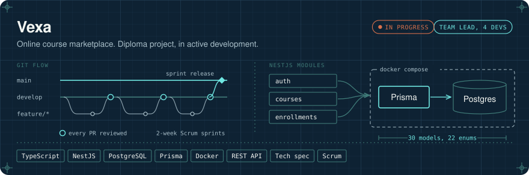
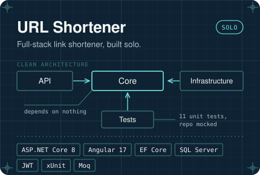
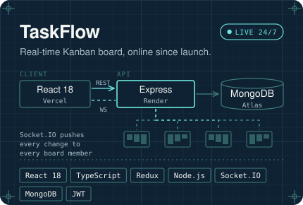
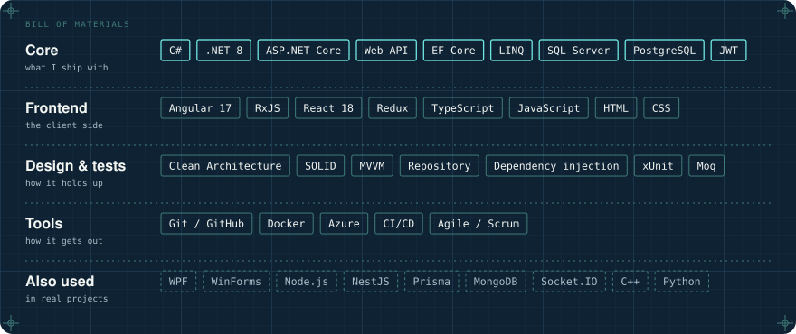

<!-- Every image in this README is generated by tools/build_assets.py. Edit the text there, not in the SVGs. -->

  
  
  
  

I build backends in C# and ASP.NET Core, plus the Angular or React client that talks to them. I like systems that have to stay correct, not just work once. Right now I'm in my final year at IT STEP, leading a four-developer team on **Vexa**, and looking for my first commercial role.

## Selected work

Each project is drawn as its own system. Click a sheet to open the repository.

  

  
  
  
  

TaskFlow is live at **[react-course-work-mu.vercel.app](https://react-course-work-mu.vercel.app)**. The reasoning behind each architecture is in the case studies on [my site](https://anton-portfolio-ten.vercel.app/#work).

<b>Smaller projects</b>

 

| Project | What it is | Built with |
| :-- | :-- | :-- |
| [MyPomodoro Timer](https://github.com/terekh373/MyPomodorroTimer) | Every Pomodoro app with custom intervals was paid, so I wrote a free one | C#, WinForms |
| [WPF Audio Player](https://github.com/terekh373/WPF_AudioPlayer) | Desktop music player with a playlist, inspired by Spotify's layout | C#, WPF |
| [Words Game](https://github.com/terekh373/WordGame_Cplusplus) | Wordle clone for the terminal; I led a team of three and wrote the game logic | C++17, OOP |
| [Shop app](https://github.com/terekh373/EXAM_ASPdotNETCore) | Online shop, final exam of the ASP.NET Core course | ASP.NET Core MVC, EF Core |

## Toolbox

## Background

| Where | What | When |
| :-- | :-- | :-- |
| IT STEP Computer Academy | Professional software development program | 2021 – 2026 |
| Kharkiv University of Technology "STEP" | BSc, Information Systems and Technologies | 2025 – 2029 |

Languages: Ukrainian (native), English (B2), German (A2–B1).

Open to remote and outstaff roles across Europe and the US. The fastest way to reach me is email: **terekh.anton.08@gmail.com**
